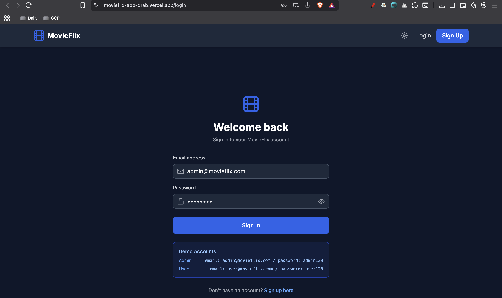
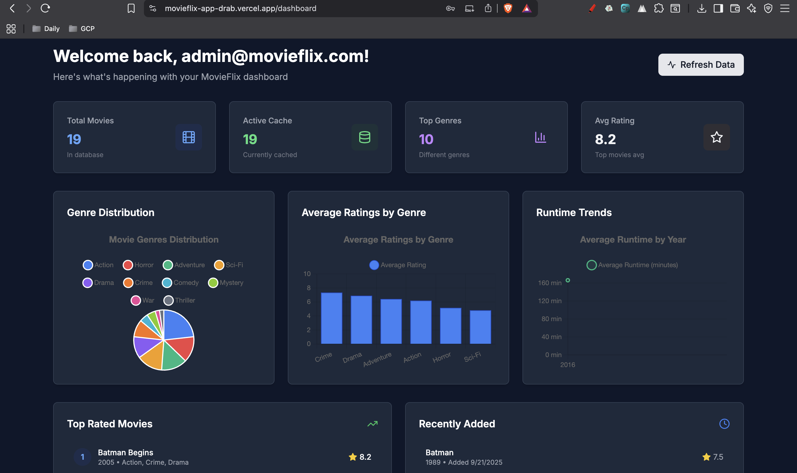
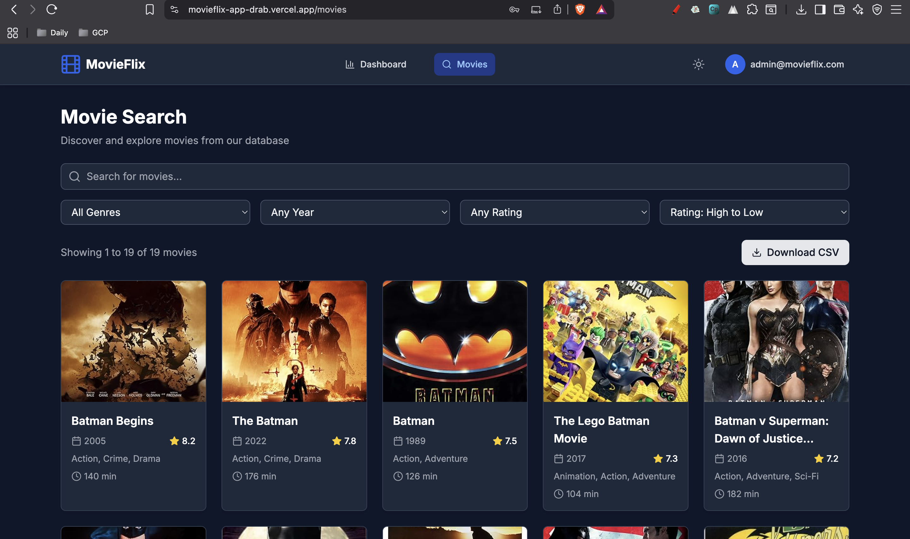

# 🎬 MovieFlix 

A modern, full-stack movie streaming application built with React and Node.js, offering users a Netflix-like experience for discovering and exploring movies.

### 🌟 Overview
MovieFlix is a comprehensive movie platform that allows users to browse, search, and discover movies with detailed information including ratings, cast, plot summaries, and more. The application features a clean, responsive design with user authentication and a rich movie database.

### ⚡️ Demo

  
  

### ✨ Key Features

User Authentication - Secure login and registration system
Movie Discovery - Browse extensive movie collections with detailed information
Advanced Search - Find movies by title, genre, year, and other criteria
Rich Movie Data - Complete movie details including IMDb ratings, cast, plot, and posters
Responsive Design - Optimized for desktop, tablet, and mobile devices
Real-time Data - Dynamic content loading with efficient caching

### 🚀 Live Demo

Frontend: https://movieflix-app-drab.vercel.app

Backend API: https://movieflix-app-production.up.railway.app/api/movies
